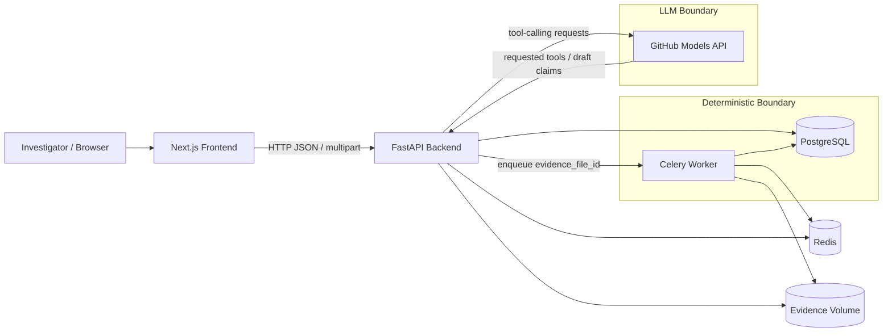
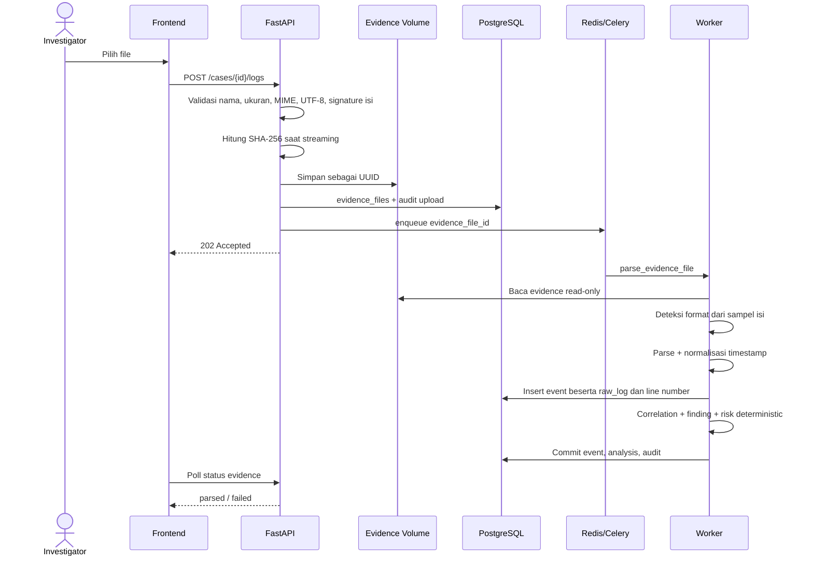
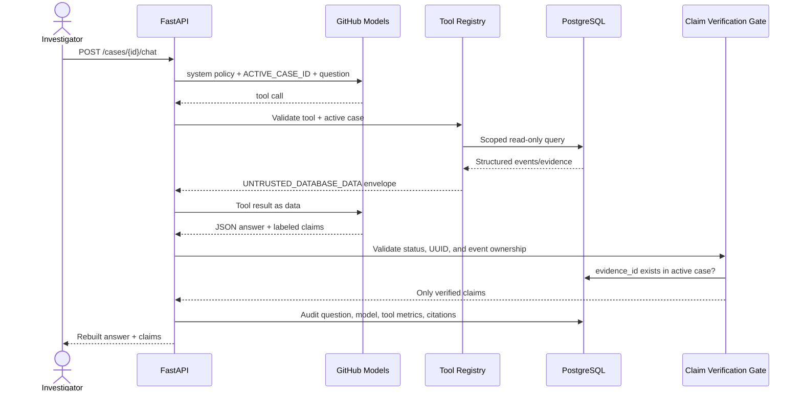
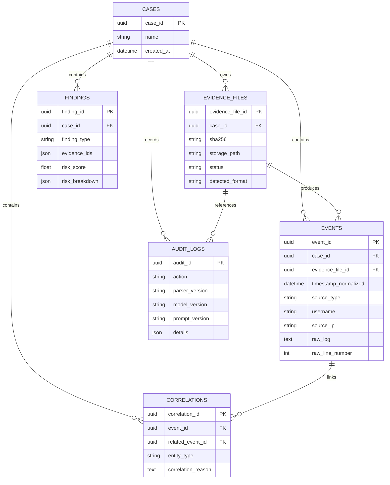

# Arsitektur TraceLens AI

Status dokumen: implementasi MVP saat ini  
Audiens: developer, reviewer keamanan, dan investigator teknis

## 1. Tujuan sistem

TraceLens AI mengubah log mentah menjadi event kanonik, timeline, correlation, finding, dan jawaban AI yang dapat ditelusuri kembali ke baris log asli. Prinsip utamanya adalah **evidence-grounded**: LLM tidak boleh mem-parsing, mengurutkan, atau mengorelasikan log dan setiap klaim yang ditampilkan harus memiliki `evidence_id` valid dalam case aktif.

## 2. Batas MVP

Format yang diimplementasikan:

- Linux `auth.log`/syslog, khususnya autentikasi SSH dan sudo;
- Nginx/Apache combined access log;
- log aplikasi JSON/JSONL generik;
- log aplikasi CSV generik dengan header umum.

Belum termasuk Windows EVTX, PCAP, Docker/Kubernetes, cloud audit log, threat intelligence eksternal, real-time ingestion, SIEM, malware analysis, dan multi-tenant.

## 3. Gambaran komponen



| Komponen | Teknologi | Tanggung jawab |
|---|---|---|
| Frontend | Next.js, React, Tailwind/CSS | Case UI, upload, timeline, event explorer, chat, findings, export |
| API | FastAPI | Validasi request, case scoping, query, rate limit, audit, orchestration chat |
| Worker | Celery | Deteksi format, parsing deterministik, penyimpanan event, rebuilding analysis |
| Database | PostgreSQL | Metadata case/evidence, event, correlation, finding, audit log |
| Queue | Redis | Broker Celery dan fixed-window rate limit |
| Evidence storage | Docker volume | Menyimpan file upload dengan nama UUID |
| LLM provider | GitHub Models, GPT-4.1 mini | Memilih tool, interpretasi, hipotesis, dan penyusunan claim |

## 4. Alur ingestion dan analisis



Karakteristik penting:

- file dihitung SHA-256 saat upload;
- nama file pengguna tidak dipakai sebagai path penyimpanan;
- satu baris malformed menggagalkan transaksi parsing file tersebut;
- `raw_log`, `raw_line_number`, dan `evidence_file_id` tidak boleh diubah setelah event tersimpan;
- parser version dicatat pada audit log;
- worker berjalan dengan concurrency `1` untuk mencegah rebuild analysis bersamaan pada case yang sama.

## 5. Parsing deterministik

Format detector memeriksa maksimal 20 baris non-kosong awal dan memberi skor berdasarkan pola isi, bukan hanya ekstensi.

```text
Linux/syslog  -> regex SYSLOG_RE
Web access    -> regex combined access log
JSON/JSONL    -> json.loads per baris
CSV           -> csv.reader + header aliases
```

Parser menghasilkan `ParsedEvent`, kemudian worker memetakannya ke tabel `events`. Timestamp syslog tanpa tahun memakai tahun upload. Timestamp tanpa timezone memakai `SERVER_TIMEZONE`. Kedua asumsi dicatat dalam `timestamp_assumptions` dan menurunkan `timestamp_confidence`.

CSV saat ini mengharapkan satu record per baris. Multiline quoted CSV record belum didukung.

## 6. Timeline, correlation, dan finding

Urutan timeline:

```text
timestamp_normalized
-> raw_line_number
-> evidence_file_id
-> event_id
```

Correlation dibuat berdasarkan `source_ip`, `username`, atau `session_id` dalam window konfigurabel. Untuk mencegah ledakan relasi kuadratik, setiap event hanya dihubungkan ke event terdekat sebelumnya untuk entity yang sama. Alasan tetap eksplisit, misalnya:

```text
shared source_ip within 10 minutes (0.5 minutes apart)
```

Finding yang tersedia:

- repeated failed authentication/brute force;
- successful login setelah kegagalan berulang dari IP sama.

Risk score:

```text
severity_weight*0.30
+ frequency_score*0.20
+ privilege_weight*0.25
+ correlation_count*0.15
+ novelty_score*0.10
```

Setiap finding menyimpan nilai dan kontribusi setiap komponen. Formula ini explainable, tetapi belum dikalibrasi terhadap dataset berlabel.

## 7. Arsitektur AI Investigator



Single agent menyediakan enam tools:

1. `search_events`
2. `get_surrounding_events`
3. `build_timeline`
4. `correlate_entities`
5. `get_raw_evidence`
6. `generate_case_summary`

LLM tidak mendapat akses database langsung. `ToolRegistry` mengikat seluruh eksekusi ke `case_id` dari URL. Argumen tool yang mencoba memakai case lain ditolak.

Raw evidence dibungkus dengan delimiter acak sebagai `UNTRUSTED_DATABASE_DATA`. Deteksi prompt-injection hanya menjadi sinyal tambahan; kontrol utamanya adalah system policy, tool allowlist, case scoping, dan claim verification setelah model menjawab.

Claim gate menerima status berikut:

- `fact`
- `inference`
- `hypothesis`

Jawaban bebas dari model tidak langsung ditampilkan. Backend membangun ulang `answer` hanya dari claim valid. Bila tidak ada claim valid, hasilnya:

```text
Belum cukup bukti untuk menjawab pertanyaan ini.
```

## 8. Model data



`event_id` sekaligus berfungsi sebagai `evidence_id` pada citation AI.

## 9. API surface

| Method | Endpoint | Fungsi |
|---|---|---|
| GET | `/health` | Health check API |
| POST | `/cases` | Membuat case |
| POST | `/cases/{id}/logs` | Upload dan enqueue parsing |
| GET | `/cases/{id}/logs` | Daftar evidence file |
| GET | `/cases/{id}/logs/{file_id}` | Status evidence |
| GET | `/cases/{id}/events` | Event pagination dan filter |
| GET | `/cases/{id}/events/{event_id}` | Raw evidence dan context |
| GET | `/cases/{id}/timeline` | Timeline + correlation |
| GET | `/cases/{id}/entities` | Ringkasan IP/user/session |
| GET | `/cases/{id}/findings` | Finding + risk breakdown |
| POST | `/cases/{id}/chat` | AI Investigator |
| POST | `/cases/{id}/exports` | Export report dan audit |

## 10. Deployment

Docker Compose menjalankan:

```text
frontend : host 3001 -> container 3000
backend  : host 8002 -> container 8000
worker   : Celery concurrency 1
postgres : internal network
redis    : internal network
evidence-init : one-shot volume ownership setup
```

Backend dan worker berjalan sebagai user non-root UID `10001`. Secret model dibaca dari `GITHUB_MODELS_TOKEN` melalui environment container dan tidak disimpan dalam database.

## 11. Trust boundaries dan kontrol keamanan

| Boundary/risiko | Kontrol saat ini |
|---|---|
| File pengguna -> backend | Size, filename, extension, MIME, UTF-8, content detection |
| Filename -> filesystem | UUID storage name dan resolved-path check |
| Raw log -> LLM | Untrusted-data envelope dan delimiter acak |
| LLM -> tools | Tool allowlist, argument validation, active-case binding |
| LLM -> investigator | Claim status enum dan database evidence verification |
| Case A -> Case B | Semua child lookup memakai `case_id` |
| Raw evidence mutation | ORM guard dan PostgreSQL trigger |
| Abuse chat/upload | Redis fixed-window rate limit per IP |
| Provider instability | Retry terbatas untuk HTTP 429/5xx |

## 12. Gap dan risiko yang perlu ditelaah

### Prioritas 0 — sebelum dipakai oleh banyak pengguna

1. **Belum ada autentikasi dan otorisasi pengguna.** Mengetahui UUID case cukup untuk mengakses case. Query memang terisolasi per case, tetapi belum ada pemeriksaan kepemilikan atau role.
2. **Belum benar-benar multi-tenant.** Tidak ada `tenant_id`, row-level security PostgreSQL, atau pemisahan encryption key.
3. **Token GitHub Models adalah secret global.** Belum ada secret manager, rotasi otomatis, atau provider credential isolation.
4. **Tidak ada malware-safe file scanning.** Validasi format bukan antivirus. File disimpan dan dibaca sebagai teks, tetapi belum dipindai oleh AV/sandbox.
5. **Chain of custody masih level aplikasi.** Belum ada digital signature, append-only/WORM storage, trusted timestamping, atau verifikasi hash berkala.

### Prioritas 1 — reliability dan scale

1. **Database migration belum formal.** Startup masih memakai `create_all`/DDL tambahan; sebaiknya menggunakan Alembic dengan revision history.
2. **Rebuild analysis masih per case penuh.** Setiap ingestion membaca ulang event case dan membangun ulang correlation/finding. Perlu incremental analysis untuk case besar.
3. **Worker concurrency satu.** Aman terhadap race pada MVP, tetapi throughput global rendah. Solusi berikutnya adalah locking per case dan concurrency lintas case.
4. **Parsing file membaca isi ke memory.** Batas 50 MiB membantu, tetapi streaming parser/batched insert lebih aman untuk scale.
5. **Satu baris malformed menggagalkan seluruh file.** Bagus untuk menghindari bukti parsial yang ambigu, tetapi perlu mode quarantine/error manifest bila investigator ingin menerima baris valid secara eksplisit.
6. **Retry provider masih in-process.** Belum ada circuit breaker, queue chat, fallback model terkontrol, atau budget/cost telemetry.
7. **Tidak ada idempotency key upload.** File sama dapat di-upload berulang dan menghasilkan event duplikat antar evidence file.

### Prioritas 1 — security engineering

1. **Rate limit hanya per-IP.** Banyak pengguna di NAT berbagi limit; attacker terdistribusi dapat menghindarinya.
2. **CORS dan deployment mengasumsikan localhost.** Produksi membutuhkan TLS, reverse proxy, secure headers, dan konfigurasi origin ketat.
3. **Audit log belum tamper-evident.** Admin database dapat mengubahnya tanpa jejak eksternal.
4. **Prompt injection tidak dapat dianggap selesai.** Delimiter dan prompt membantu, tetapi pertahanan utama harus terus diuji melalui regression/eval adversarial.
5. **Raw evidence dapat berisi data pribadi atau secret.** Belum ada retention policy, access logging per user, redaction view, atau encryption at rest yang dikelola aplikasi.

### Prioritas 2 — kualitas investigasi

1. Risk weights bersifat heuristik dan belum dikalibrasi.
2. Novelty score saat ini sederhana dan belum memiliki baseline historis yang kuat.
3. Correlation nearest-predecessor menjaga skala, tetapi dapat menyembunyikan relasi many-to-many yang penting.
4. Parser CSV belum mendukung multiline record dan mapping schema kustom.
5. Parser hanya mencakup subset pola Linux authentication/sudo.
6. Belum ada timezone per source/evidence; default menggunakan timezone server.
7. Belum ada eval suite kualitas jawaban model berbasis dataset berlabel, hanya regression untuk citation, injection, dan insufficient evidence.
8. Report PDF masih sederhana dan belum memiliki template evidentiary formal, signature, atau manifest hash lampiran.

## 13. Rekomendasi urutan penguatan

1. Tambahkan authentication, authorization, dan ownership case.
2. Tambahkan Alembic dan backup/restore test PostgreSQL + evidence volume.
3. Implementasikan per-case distributed lock dan incremental analysis.
4. Jadikan audit log tamper-evident dan tambahkan evidence integrity verification job.
5. Tambahkan observability: structured log, metrics queue latency, parse duration, tool trajectory, provider error rate, dan alert.
6. Bangun eval corpus untuk parser, finding precision/recall, prompt injection, claim grounding, serta model/provider regression.
7. Setelah fondasi aman, pertimbangkan format tambahan secara eksplisit satu per satu.

## 14. Pertanyaan review arsitektur

- Siapa yang boleh membuat, membuka, dan mengekspor sebuah case?
- Apakah raw evidence harus memenuhi standar legal chain-of-custody tertentu?
- Berapa ukuran file, jumlah event per case, dan jumlah case bersamaan yang ditargetkan?
- Apakah kegagalan satu baris harus menolak file atau menghasilkan quarantine manifest?
- Apakah data boleh dikirim ke GitHub Models menurut klasifikasi dan kebijakan organisasi?
- Berapa lama evidence, event, chat, dan audit log harus disimpan?
- Apakah availability chat AI wajib, atau deterministic findings cukup saat provider unavailable?
- Format log berikutnya dipilih berdasarkan use case apa dan contoh corpus mana?

## 15. Referensi internal

- [Threat model](THREAT_MODEL.md)
- [Panduan menambah parser](ADDING_A_PARSER.md)
- [README proyek](../README.md)

