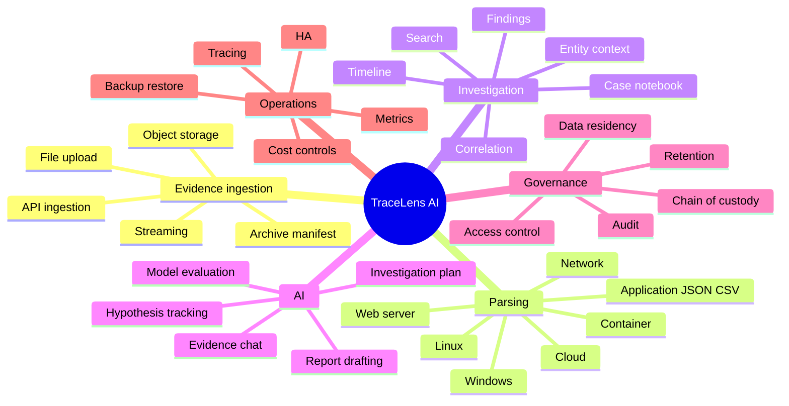

# Cakupan Ide Produk TraceLens AI

Status: dokumen eksplorasi dan kandidat roadmap  
Tujuan: menginventarisasi arah pengembangan tanpa menganggap semua ide sebagai komitmen implementasi  
Pembaca: product owner, engineer, security reviewer, investigator, dan calon pengguna

> **Penting:** bagian “Sudah tersedia” menggambarkan implementasi saat ini. Seluruh bagian lain adalah ide kandidat. Ide di luar MVP harus melewati validasi kebutuhan, threat modeling, desain, dan persetujuan scope sebelum dibangun.

## 1. Visi produk

TraceLens AI adalah workspace investigasi log keamanan yang mengubah data log heterogen menjadi timeline insiden, correlation, finding, dan laporan yang dapat diverifikasi. Nilai pembeda utamanya:

- parsing dan analisis dasar dilakukan secara deterministik;
- raw evidence tidak ditulis ulang;
- setiap klaim AI wajib memiliki citation ke event dalam case aktif;
- fakta, inference, dan hypothesis dibedakan secara eksplisit;
- sistem mengakui ketika evidence belum cukup;
- setiap transformasi penting meninggalkan audit trail.

## 2. Masalah yang ingin diselesaikan

1. Investigator menghabiskan banyak waktu membaca log mentah yang formatnya berbeda.
2. Timestamp antar sumber sulit diselaraskan.
3. Aktivitas yang sama tersebar di banyak file, IP, user, session, dan host.
4. Hasil analisis AI sering tidak dapat dilacak ke bukti asli.
5. Laporan investigasi sering kehilangan konteks sumber, parser, dan asumsi waktu.
6. Tool enterprise terlalu berat untuk pembelajaran, lab kecil, atau investigasi ad hoc.

## 3. Persona pengguna

| Persona | Kebutuhan utama | Tingkat teknis |
|---|---|---|
| SOC analyst | Triage cepat, timeline, evidence citation | Menengah–tinggi |
| Incident responder | Rekonstruksi insiden dan laporan | Tinggi |
| Digital forensics student | Memahami hubungan log dan bukti | Pemula–menengah |
| Security engineer | Menguji parser/rule dan hardening sistem | Tinggi |
| Auditor/reviewer | Menilai chain-of-custody dan keputusan | Menengah |
| Team lead | Ringkasan risiko dan progres case | Menengah |

## 4. Status kemampuan saat ini

### Sudah tersedia

- case creation;
- upload file dengan SHA-256;
- validasi ukuran, MIME, extension, UTF-8, dan path traversal;
- deteksi format berbasis isi;
- parser Linux auth/syslog;
- parser OpenSSH pattern;
- parser Nginx/Apache combined access log;
- parser JSON/JSONL aplikasi generik;
- parser CSV aplikasi generik;
- schema event kanonik;
- timeline deterministik;
- correlation berdasarkan IP, username, dan session;
- rule brute force dan successful login after failures;
- explainable risk breakdown;
- event explorer dan raw evidence viewer;
- AI chat dengan GitHub Models dan tool-calling;
- claim verification berdasarkan `evidence_id`;
- label fact/inference/hypothesis;
- prompt-injection data boundary;
- Markdown/simple PDF workflow;
- audit upload, parsing, chat, dan export;
- Docker Compose, PostgreSQL, Redis, Celery, FastAPI, dan Next.js.

### Batas implementasi saat ini

- satu deployment lokal, belum multi-tenant;
- belum ada login pengguna;
- worker parsing concurrency satu;
- correlation/finding dibangun ulang per case;
- provider AI bergantung pada rate limit GitHub Models;
- belum ada format enterprise seperti EVTX, cloud audit, atau EDR telemetry.

## 5. Peta capability jangka panjang



## 6. Ide ingestion dan evidence handling

### Peningkatan dekat

- drag-and-drop banyak file dengan grouping per source;
- deduplication berdasarkan SHA-256 dalam case;
- idempotency key untuk upload API;
- upload manifest berisi source name, host, timezone, dan collection time;
- pilihan timezone per evidence file;
- quarantine manifest untuk baris malformed;
- preview deteksi format sebelum enqueue;
- estimasi jumlah baris dan durasi parsing;
- cancel/retry parsing job;
- checksum verification berkala;
- evidence download dengan audit event.

### Kandidat post-MVP

- ZIP/TAR ingestion dengan proteksi zip bomb dan traversal;
- S3/MinIO-compatible object storage;
- collector CLI untuk hash dan upload evidence;
- ingestion API bertanda tangan;
- folder/batch ingestion;
- watch directory;
- syslog receiver;
- real-time streaming ingestion;
- Kafka/Redpanda pipeline;
- remote evidence acquisition workflow;
- WORM/immutable object lock;
- trusted timestamp authority;
- evidence digital signature dan manifest signing.

## 7. Ide cakupan format parser

### Tier A — perluasan natural setelah MVP

| Format | Contoh sumber | Nilai investigasi |
|---|---|---|
| Linux auditd | `/var/log/audit/audit.log` | Process, syscall, file, privilege |
| sudo detail | auth/syslog | Privilege escalation |
| systemd journal export | `journalctl -o json` | Structured Linux events |
| Nginx JSON access | custom log format | Web activity structured |
| Apache error log | error.log | Server/application failures |
| Application CEF/LEEF | security products | Standardized security events |
| Generic key-value | `key=value` logs | Flexible application telemetry |

### Tier B — endpoint dan identity

- Windows EVTX;
- Windows Event XML;
- Sysmon;
- PowerShell operational logs;
- Microsoft Defender/EDR export;
- macOS unified log export;
- Linux `wtmp`, `btmp`, dan `lastlog` melalui extractor deterministik;
- VPN authentication logs;
- RADIUS/TACACS+;
- Active Directory authentication export.

### Tier C — cloud dan SaaS

- AWS CloudTrail;
- AWS VPC Flow Logs;
- AWS GuardDuty export;
- Azure Activity Log;
- Microsoft Entra sign-in/audit logs;
- Google Cloud Audit Logs;
- Google Workspace audit;
- Microsoft 365 Unified Audit Log;
- Okta System Log;
- GitHub organization audit log;
- Cloudflare logs.

### Tier D — container dan orchestration

- Docker JSON log;
- Kubernetes audit log;
- Kubernetes application logs;
- ingress controller logs;
- container runtime events;
- Falco event export;
- OpenTelemetry logs.

### Tier E — network dan security appliances

- firewall CSV/syslog;
- IDS/IPS alerts;
- Suricata EVE JSON;
- Zeek logs;
- DNS resolver logs;
- proxy logs;
- NetFlow/IPFIX export;
- WAF logs;
- email gateway logs;
- DLP alert export.

### Aturan penambahan parser

Setiap parser baru sebaiknya wajib memiliki:

- corpus contoh legal dan terdokumentasi;
- detector berbasis isi;
- parser version;
- unit test valid, missing field, malformed, dan large input;
- timestamp assumptions;
- mapping ke schema kanonik;
- dokumentasi field yang hilang atau lossy;
- benchmark parsing;
- threat review untuk payload hostile.

## 8. Ide schema kanonik

Field tambahan potensial:

- `event_provider`;
- `event_dataset`;
- `observer_type`;
- `source_port` dan `destination_port`;
- `network_protocol`;
- `http_method`, `http_path`, `http_status`, `user_agent`;
- `process_id`, `parent_process_id`, `parent_process_name`;
- `command_line`;
- `file_hash_sha256`;
- `domain`, `url`, `email_address`;
- `device_id`, `cloud_account_id`, `container_id`;
- `authentication_method`;
- `geo_country` sebagai enrichment terpisah;
- `original_event_id` dari sumber;
- `ingested_at` dan `parsed_at`;
- `schema_version`;
- `parse_warnings`;
- `field_provenance` untuk menunjukkan asal setiap field.

Perubahan schema harus memakai migration formal dan versioning. Raw evidence tetap sumber kebenaran; enrichment tidak boleh menggantikan nilai parsed awal tanpa provenance.

## 9. Ide timeline

- virtualized timeline untuk jutaan event;
- zoom waktu dan bucket density;
- group by host/source/user;
- compare dua timezone;
- tampilkan confidence/asumsi timestamp;
- bookmark event;
- pin evidence ke investigation notebook;
- annotate event oleh investigator;
- merge/split activity cluster;
- gap detection;
- clock-skew detection antar host;
- timeline diff sebelum/sesudah incident window;
- export timeline CSV/JSON/Markdown;
- snapshot timeline yang reproducible berdasarkan analysis version.

## 10. Ide search dan event explorer

- full-text search PostgreSQL;
- query builder visual;
- saved filters;
- reusable search templates;
- regex search dengan timeout;
- field existence query;
- range query waktu/numerik;
- negative filters;
- search raw log dan normalized fields secara terpisah;
- highlight match;
- before/after context konfigurabel;
- pagination cursor;
- bulk tagging;
- export selected events;
- explain query;
- search history dan audit.

Untuk skala lebih besar dapat dievaluasi OpenSearch/ClickHouse, tetapi jangan ditambahkan sebelum PostgreSQL terbukti menjadi bottleneck.

## 11. Ide correlation engine

### Rule-based deterministic

- shared IP/user/session/host;
- impossible travel berbasis evidence internal;
- login dari IP baru terhadap baseline case;
- repeated 401/403 lalu 200;
- password spray: satu IP, banyak username;
- credential stuffing: banyak IP, satu username;
- sudo setelah login remote;
- process spawn chain;
- file access setelah privilege escalation;
- web request lalu application error;
- session hijack indicators;
- cross-source correlation dengan clock tolerance;
- configurable rule YAML/JSON;
- rule version dan test fixture;
- suppression/exception list;
- deterministic correlation explanation.

### Skala dan representation

- incremental correlation;
- per-case distributed lock;
- bounded correlation fan-out;
- activity cluster;
- materialized entity summary;
- optional graph projection;
- confidence per correlation;
- provenance dan rule version pada setiap edge.

LLM tidak boleh menggantikan correlation deterministic. LLM hanya boleh menjelaskan atau mengusulkan hipotesis berdasarkan correlation yang sudah dihitung.

## 12. Ide detection dan findings

### Authentication

- brute force;
- successful login after failures;
- password spray;
- login privileged account;
- unusual authentication time;
- repeated invalid user;
- session reuse;
- authentication from multiple IPs.

### Web

- scanning/path enumeration;
- high 4xx rate;
- suspicious user agent;
- SQL injection pattern;
- path traversal pattern;
- command injection pattern;
- upload followed by access;
- sudden response-size anomaly.

### Linux/process

- sudo escalation;
- new user creation;
- SSH key modification;
- cron persistence indicators;
- suspicious process execution;
- sensitive file access;
- service stop/start sequence.

### Finding lifecycle

- status: new, triaged, confirmed, false positive, resolved;
- owner/assignee;
- analyst notes;
- severity override dengan alasan;
- suppression expiry;
- evidence list;
- finding version history;
- deterministic replay;
- ATT&CK mapping sebagai metadata terpisah;
- confidence dan data-quality warning.

## 13. Ide risk scoring

- severity normalization per source;
- configurable weights per organization;
- cap correlation contribution agar tidak tak terbatas;
- asset criticality;
- privileged identity weight;
- finding confidence;
- evidence quality/confidence;
- temporal decay;
- baseline rarity;
- analyst override dengan audit;
- score versioning;
- calibration menggunakan labeled corpus;
- precision/recall dan threshold evaluation;
- explanation counterfactual: komponen apa yang menaikkan skor.

Risk score tidak boleh menjadi satu-satunya dasar keputusan respons insiden.

## 14. Ide entity intelligence

- halaman detail IP;
- halaman detail user;
- halaman detail host;
- halaman detail session;
- process/file entity;
- first seen/last seen;
- related findings;
- event distribution;
- source coverage;
- aliases/normalization;
- investigator labels;
- optional entity graph setelah kebutuhan tervalidasi.

Threat intelligence eksternal harus menjadi enrichment terpisah dengan source, retrieval time, license, dan confidence. Data eksternal tidak boleh diperlakukan sebagai raw case evidence tanpa label yang jelas.

## 15. Ide Agentic AI

### Kemampuan yang masih sesuai prinsip produk

- investigation planning;
- pertanyaan natural language;
- memilih tool read-only;
- menjelaskan timeline;
- membandingkan finding;
- menyusun hypothesis;
- menunjukkan evidence pendukung dan evidence yang bertentangan;
- menyarankan data tambahan yang perlu dikumpulkan;
- menyusun draft laporan;
- menjelaskan risk breakdown;
- multilingual investigator chat.

### Struktur claim yang dapat diperluas

```json
{
  "text": "...",
  "status": "fact|inference|hypothesis",
  "evidence_ids": ["uuid"],
  "confidence": 0.0,
  "reasoning_summary": "...",
  "limitations": ["..."]
}
```

Saat ini satu claim memakai satu `evidence_id`. Dukungan multi-evidence dapat dipertimbangkan dengan validator yang tetap memastikan semua ID berasal dari case aktif.

### Guardrail tambahan

- structured output/schema enforcement;
- tool argument schema validation lebih ketat;
- tool result size budget;
- prompt and model version registry;
- per-model compatibility tests;
- circuit breaker provider;
- controlled fallback model;
- token/cost budget per case;
- adversarial prompt-injection corpus;
- refusal regression;
- citation coverage metric;
- contradiction check;
- no-evidence response metric;
- manual analyst approval untuk report final.

### Hal yang tidak boleh diberikan kepada LLM

- parsing raw log;
- normalisasi timestamp;
- canonical sorting;
- correlation dasar;
- evidence ID creation;
- mutasi raw evidence;
- keputusan otomatis yang menghapus/menahan akun;
- klaim tanpa validator backend.

## 16. Ide case management

- case status dan priority;
- case owner;
- collaborators;
- role-based access;
- case tags;
- incident start/end time;
- affected assets;
- scope statement;
- task checklist;
- investigation notebook;
- evidence collection request;
- activity log;
- case template;
- clone case metadata tanpa evidence;
- archive/restore;
- retention hold;
- case closure review;
- evidence manifest saat penutupan.

## 17. Ide laporan

- executive summary;
- technical timeline;
- findings table;
- risk breakdown;
- evidence appendix;
- parser/model/prompt version appendix;
- timestamp assumption appendix;
- chain-of-custody manifest;
- Markdown, PDF, JSON, dan CSV export;
- customizable report template;
- organization branding;
- report versioning;
- reviewer approval;
- digital signature;
- hash report;
- redacted and full-evidence variants;
- reproducibility metadata.

## 18. Ide UX dan visualisasi

- onboarding dengan sample case;
- parser support matrix pada halaman upload;
- parsing ETA dan progress per tahap;
- error detail yang bisa ditindaklanjuti;
- dashboard data-quality warnings;
- keyboard navigation;
- accessible contrast selain kode warna;
- responsive layout;
- saved workspace;
- investigator notes;
- evidence drawer global;
- citation hover preview;
- click citation membuka raw line dan context;
- side-by-side fact vs inference;
- localized Indonesian/English UI;
- theme preference;
- empty-state guidance;
- guided investigation checklist.

## 19. Ide identity, authorization, dan tenancy

Urutan yang disarankan:

1. local admin/user authentication;
2. case ownership;
3. RBAC: viewer, investigator, reviewer, admin;
4. session security dan CSRF protection;
5. OIDC/SAML SSO;
6. tenant organization;
7. PostgreSQL row-level security;
8. tenant-scoped encryption keys;
9. per-user/per-tenant quota;
10. break-glass access dengan audit.

UUID case bukan mekanisme authorization.

## 20. Ide security dan privacy

- TLS termination;
- secure headers/CSP;
- CSRF protection;
- secret manager;
- token rotation;
- encryption at rest;
- field-level encryption untuk secret tertentu;
- antivirus scanning;
- decompression bomb protection;
- parser resource limits;
- query timeout;
- export authorization;
- download watermark;
- immutable audit sink;
- audit hash chaining;
- data retention/deletion policy;
- legal hold;
- PII classification;
- redacted views;
- provider data policy control;
- egress allowlist;
- dependency scanning;
- SBOM;
- signed container image;
- backup encryption;
- disaster recovery exercise;
- external penetration test sebelum production.

## 21. Ide observability dan operasi

### Metrics

- upload count/bytes;
- queue depth;
- queue latency;
- parse duration dan throughput;
- malformed line rate;
- event count per format;
- correlation/finding duration;
- API latency/error rate;
- provider latency/status/rate limit;
- tool calls per chat;
- claim acceptance/rejection rate;
- citation coverage;
- database size;
- evidence volume usage.

### Logging dan tracing

- structured application logs;
- correlation/request ID;
- Celery task ID;
- trace upload sampai finding;
- trace chat rounds tanpa merekam secret;
- PII-safe logs;
- alert untuk stuck parsing;
- alert untuk evidence integrity mismatch.

### Reliability

- health/readiness checks;
- graceful shutdown;
- retry policy per dependency;
- dead-letter queue;
- job watchdog;
- backup PostgreSQL dan evidence volume;
- restore test otomatis;
- retention cleanup job;
- capacity dashboard;
- documented runbook.

## 22. Ide testing dan evaluation

### Parser

- golden fixtures;
- property-based tests;
- fuzzing;
- Unicode edge cases;
- timestamp boundary/DST;
- large-file benchmark;
- hostile payload/resource exhaustion;
- parser compatibility corpus.

### Correlation dan findings

- deterministic replay;
- labeled attack scenarios;
- false-positive fixtures;
- rule version regression;
- scale test dense entities;
- concurrent ingestion test;
- incremental-vs-full rebuild equivalence.

### AI

- every displayed sentence cited;
- invalid/cross-case evidence rejected;
- insufficient evidence response;
- prompt injection in every supported field;
- tool misuse;
- malformed structured output;
- provider/model compatibility matrix;
- citation correctness—not hanya UUID validity;
- contradiction and overclaim evaluation;
- Indonesian/English question set;
- human investigator scoring.

### Security

- path traversal;
- MIME spoofing;
- zip bomb bila archive didukung;
- unauthorized cross-case access;
- IDOR;
- rate-limit bypass;
- SQL injection;
- stored XSS melalui raw log;
- SSRF bila remote ingestion ditambahkan;
- audit tampering;
- secret leakage.

## 23. Ide deployment evolution

### Local/lab

- Docker Compose;
- local volume;
- one backend dan one worker.

### Small team

- reverse proxy + TLS;
- managed PostgreSQL;
- object storage;
- secret manager;
- authentication;
- backup terjadwal;
- monitoring dasar.

### Production

- container orchestration;
- horizontal API scaling;
- worker queues per workload;
- per-case locking;
- managed Redis;
- high availability database;
- immutable evidence storage;
- centralized audit;
- autoscaling dengan queue depth;
- data residency controls;
- disaster recovery target RPO/RTO.

Kubernetes bukan kebutuhan otomatis; gunakan hanya bila scale dan operational maturity membenarkannya.

## 24. Non-functional requirements kandidat

| Area | Target awal yang perlu diputuskan |
|---|---|
| File size | 50 MiB saat ini; target production belum ditentukan |
| Events per case | Perlu target dan load test eksplisit |
| Parse throughput | Perlu SLO per format/ukuran |
| API latency | P95 untuk query non-AI |
| AI latency | P95 dan timeout per provider |
| Availability | Local MVP vs production SLO |
| Durability | Backup, RPO, RTO |
| Retention | Evidence/event/audit/chat |
| Privacy | Data classification dan provider eligibility |
| Accessibility | WCAG target |

## 25. KPI produk kandidat

- median time from upload to first finding;
- percentage event parsed successfully;
- percentage timestamp dengan confidence tinggi;
- claim citation coverage;
- citation correctness berdasarkan human review;
- insufficient-evidence honesty rate;
- false-positive rate finding;
- investigator time saved;
- report preparation time;
- mean provider error rate;
- parsing failure resolution time;
- evidence integrity verification success.

Hindari KPI “jumlah claim AI” karena mendorong verbosity dan overclaim.

## 26. Roadmap yang disarankan

### Fase A — stabilisasi MVP

- authentication sederhana;
- case ownership;
- Alembic migrations;
- provider error UX;
- observability minimum;
- upload deduplication;
- stuck-job recovery;
- parser benchmark;
- backup/restore documentation.

### Fase B — investigation quality

- case notebook dan annotations;
- saved search;
- finding lifecycle;
- additional deterministic rules;
- multi-evidence claims;
- eval corpus dan citation correctness;
- report evidence appendix.

### Fase C — scale dan team workflow

- per-case lock + parallel workers;
- incremental correlation;
- object storage;
- RBAC;
- collaboration/reviewer workflow;
- tamper-evident audit;
- metrics/alerts lengkap.

### Fase D — format expansion

- pilih satu format berdasarkan pengguna nyata;
- Linux auditd atau Windows EVTX sebagai kandidat awal;
- setiap format melewati corpus, benchmark, security review, dan documentation gate.

### Fase E — integrations

- collector CLI;
- API key/service account;
- SIEM export/import;
- cloud source connectors;
- real-time ingestion bila use case membutuhkannya.

## 27. Prioritized backlog ringkas

### P0

- [ ] Authentication dan case authorization
- [ ] Alembic database migrations
- [ ] Secret management dan token rotation
- [ ] Backup/restore test
- [ ] Stuck parsing recovery
- [ ] Audit dan evidence integrity verification

### P1

- [ ] Per-case distributed lock
- [ ] Incremental correlation/findings
- [ ] Upload deduplication/idempotency
- [ ] Structured logs dan metrics
- [ ] Finding lifecycle
- [ ] Case notebook/annotations
- [ ] AI eval corpus dan citation correctness
- [ ] Improved report manifest

### P2

- [ ] Saved search/query builder
- [ ] Extended Linux parser/auditd
- [ ] Multi-evidence claims
- [ ] Object storage
- [ ] RBAC/SSO
- [ ] Threat intel enrichment boundary
- [ ] Additional export formats

### P3 / research

- [ ] Windows EVTX
- [ ] Cloud audit connectors
- [ ] Kubernetes/container logs
- [ ] Network telemetry
- [ ] Real-time ingestion
- [ ] Entity graph
- [ ] Multi-tenant SaaS architecture

## 28. Ide yang sebaiknya tidak langsung dibangun

- multi-agent hanya untuk terlihat “agentic”;
- black-box anomaly model sebelum deterministic baseline matang;
- interactive graph sebelum entity use case tervalidasi;
- puluhan parser tanpa corpus dan test;
- Kubernetes untuk deployment satu mesin;
- automated response/containment tanpa approval;
- LLM parsing raw log;
- external threat intel tanpa provenance/license;
- custom cryptography untuk chain-of-custody;
- multi-tenant sebelum authorization dan isolation kuat.

## 29. Decision gates

Sebelum sebuah ide masuk implementasi, jawab:

1. Masalah pengguna apa yang diselesaikan?
2. Apakah masih sesuai evidence-grounded principle?
3. Apakah memerlukan format/data baru?
4. Apa trust boundary baru yang muncul?
5. Bagaimana test acceptance dan failure mode-nya?
6. Bagaimana audit dan provenance dicatat?
7. Apa dampak performance dan storage?
8. Apakah ada implikasi privacy, license, atau data residency?
9. Apakah bisa dimulai dengan deterministic implementation?
10. Apa yang sengaja tidak dibangun pada iterasi tersebut?

## 30. Dokumen turunan yang disarankan

- Product Requirements Document per fase;
- Architecture Decision Records;
- parser support matrix;
- canonical schema specification;
- rule authoring guide;
- AI evaluation specification;
- incident response runbook untuk platform;
- backup/restore runbook;
- data retention policy;
- chain-of-custody procedure;
- release checklist;
- production readiness review.

## Referensi internal

- [Arsitektur TraceLens](ARCHITECTURE.md)
- [Threat model](THREAT_MODEL.md)
- [Panduan menambah parser](ADDING_A_PARSER.md)
- [README](../README.md)

